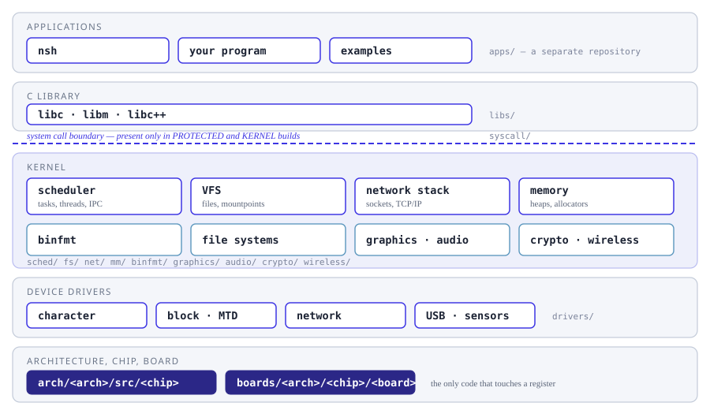
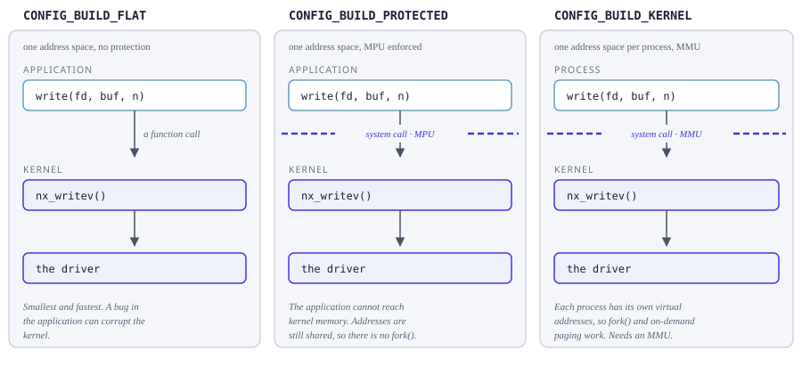

=========
OS Design
=========

How NuttX is built, subsystem by subsystem.  The sections follow the source
tree: what lives under ``sched/`` is described in :doc:`scheduling/index`,
what lives under ``fs/`` in :doc:`filesystem/index`, under ``drivers/`` in
:doc:`drivers/index`, and so on.  Each subsystem is described once, going
from what it is, to how it works, to the interfaces it offers.

For the POSIX interface an application sees, go to
:doc:`/reference/user/index` instead.  That is a different question -- what
you may call -- and it has its own section.

         and the system call boundary to the kernel subsystems, the device
         drivers, and the architecture, chip and board code.

   Where each section of this documentation sits in the system, and which
   directory of the source tree it describes.

The one decision that changes everything
========================================

Before reading any subsystem page it is worth knowing which **build mode**
you are in, because it decides whether there is a boundary between your
application and the kernel at all:

         call in a flat build, a system call across an MPU boundary in a
         protected build, and a system call into a separate address space in
         a kernel build.

   The same ``write()`` under ``CONFIG_BUILD_FLAT``,
   ``CONFIG_BUILD_PROTECTED`` and ``CONFIG_BUILD_KERNEL``.

A flat build is one program: calling ``write()`` is a function call, and an
application bug can corrupt the kernel.  A protected build puts an MPU
between the two halves, so the same call becomes a system call.  A kernel
build goes further and gives each process its own address space through an
MMU, which is what makes ``fork()`` and on-demand paging possible -- and why
they do not exist in the other two.

Much of what the pages below say depends on this choice, which is why it is
worth settling first.

The kernel
==========

.. toctree::
   :maxdepth: 1

   scheduling/index.rst
   ipc/index.rst
   time/index.rst
   interrupts/index.rst
   memory/index.rst

Storage and I/O
===============

.. toctree::
   :maxdepth: 1

   filesystem/index.rst
   drivers/index.rst
   networking/index.rst

Running programs
================

.. toctree::
   :maxdepth: 1

   binfmt/index.rst
   syscall.rst
   libs/index.rst

Media and security
==================

.. toctree::
   :maxdepth: 1

   graphics/index.rst
   audio/index.rst
   video.rst
   crypto.rst
   wireless.rst

Portability
===========

.. toctree::
   :maxdepth: 1

   arch/index.rst
   openamp.rst
   concurrency/index.rst

Reference
=========

.. toctree::
   :maxdepth: 1

   nuttx.rst
   app_vs_os.rst
   conventions.rst
   notifier.rst
