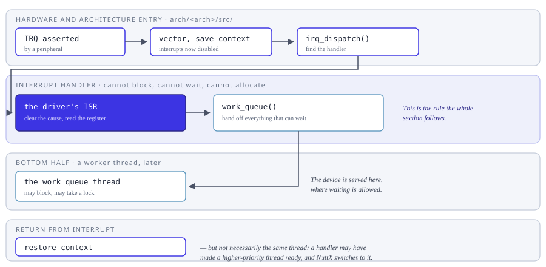

==========
Interrupts
==========

How NuttX takes an interrupt, what an interrupt handler may and may not do,
and how code protects itself from one.  The code lives in ``sched/irq/``,
with the vector table and the entry sequence in
``arch/<arch>/src/``.

On most architectures an interrupt handler runs with interrupts disabled --
nesting is the exception rather than the rule, and
:doc:`/guides/concurrency/nestedinterrupts` covers it -- and on every
architecture the handler cannot block.  That is the whole reason the rest of
this section exists: anything that has to wait, allocate or take a lock has
to be handed off, which is what :doc:`bottom halves <bottomhalf_interrupt>`
and the work queues are for.

         to the driver handler which does only what cannot wait, and the
         rest is handed to a work queue thread; on return the scheduler may
         switch to a different thread.

   From the peripheral asserting the line to the return, and where the work
   that cannot be done in a handler goes instead.

The last step is the one that surprises people: returning from an interrupt
does not necessarily return to the thread that was interrupted.  A handler
often makes a higher-priority thread ready -- that is usually the whole
point -- and NuttX switches to it before the interrupted thread runs again.

For protecting a section of code, note that disabling interrupts and
locking pre-emption are not the same choice and do not cost the same.  See
:doc:`critical_sections` for the difference, and
:doc:`/os/scheduling/preemption_latency` for what each one does to response
time.

.. toctree::
   :maxdepth: 1

   interrupt_controls.rst
   critical_sections.rst
   bottomhalf_interrupt.rst
